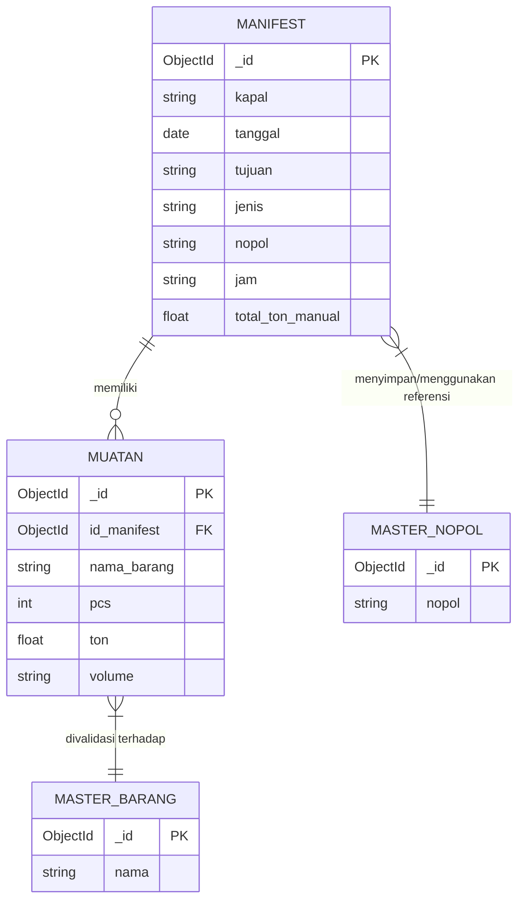
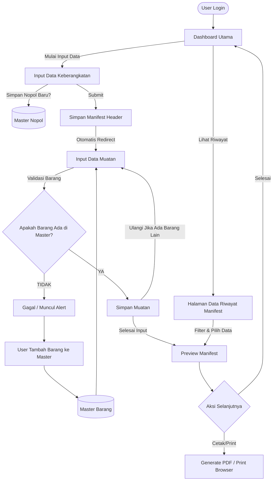

# Blueprint & Core Features: Cargo Manifest System

## 1. Core Features (Fitur Utama)

Aplikasi ini adalah sistem manajemen manifest kargo tingkat perusahaan (enterprise-grade) dengan validasi data yang ketat. Berikut adalah fitur-fitur utamanya:

1.  **Dashboard & Statistik**
    *   Halaman interaktif yang menampilkan rangkuman data manifest (`dashboard.php`).
    *   Terdapat grafik statistik (bar chart) yang menampilkan jumlah manifest per bulan.
    *   Menampilkan riwayat manifestasi terbaru untuk akses cepat.

2.  **Manajemen Keberangkatan Kapal**
    *   Modul untuk mencatat data awal pengiriman (`input_keberangkatan.php`).
    *   Mencakup pencatatan nama kapal, tanggal keberangkatan, tujuan, jenis kendaraan, dan jam berangkat.
    *   Terdapat fitur *Master Nopol*, yang menyimpan nomor polisi kendaraan secara dinamis dan menyajikannya dalam fitur autocomplete untuk input selanjutnya.

3.  **Manajemen Muatan Kargo (Strict Data Validation)**
    *   Modul detail barang yang dibawa (`input_muatan.php`).
    *   Dilengkapi validasi ketat di mana barang yang diinput **harus** terdaftar pada database *Master Barang*.
    *   Menghitung tonase dan volume (PCS, Ton, Volume) dari muatan.
    *   Fitur "Total Ton Manual" untuk menimpa kalkulasi otomatis jika terdapat penyesuaian lapangan.

4.  **Manajemen Master Data (API Base)**
    *   Sistem untuk mengelola daftar barang bawaan secara terpusat (`api_master_barang.php`).
    *   Bisa menambah atau menghapus data referensi barang langsung dari halaman input muatan tanpa perlu berpindah halaman, menggunakan AJAX/Fetch API.

5.  **Pelaporan dan Dokumen (PDF Generation & Preview)**
    *   Fungsi melihat ulang seluruh data (header kapal + detail muatan) sebelum dicetak (`preview_manifest.php`).
    *   Konversi hasil akhir ke dalam bentuk file PDF untuk keperluan fisik/corporate (`cetak_pdf.php`).

6.  **Riwayat & Rekapitulasi Data**
    *   Halaman khusus yang menampilkan seluruh riwayat data manifest (`data.php`).
    *   Terdapat fitur filter yang powerful (pencarian berdasarkan nama kapal, nomor polisi, dan rentang tanggal).

---

## 2. Entity Relationship Diagram (ERD)

Sistem ini menggunakan **MongoDB** (NoSQL), namun secara logik relasional strukturnya dapat digambarkan sebagai berikut:

*Catatan:*
*   `MUATAN.id_manifest` merujuk ke `MANIFEST._id`.
*   Data barang pada `MUATAN` divalidasi ke `MASTER_BARANG` untuk memastikan konsistensi (Data Integrity).
*   Data `nopol` dari `MANIFEST` akan disimpan/diambil dari `MASTER_NOPOL` untuk membantu auto-complete.

---

## 3. Application Workflow (Flow App)

Alur kerja aplikasi dirancang secara bertahap (step-by-step) agar meminimalisir kesalahan input:

### Penjelasan Workflow:
1.  **Login & Dashboard**: User masuk sistem (opsional login page) dan diarahkan ke Dashboard. Di sini user melihat overview (grafik bar chart) manifest bulanan dan aktivitas terbaru.
2.  **Langkah 1 (Header Keberangkatan)**: User memulai dari formulir Keberangkatan. Di sini user mengisi identitas transportasi laut/darat (Kapal, Tanggal, Nopol kendaraan). Nopol akan ter-record di *Master Nopol*.
3.  **Langkah 2 (Daftar Muatan)**: Setelah header tercipta, aplikasi lanjut ke input muatan. Barang yang dimasukkan akan dicek otomatis ke *Master Barang* melalui Fetch API (`api_master_barang.php`).
4.  **Manajemen Master (On-The-Fly)**: Jika user menginput barang asing yang belum terdaftar, form akan menolak. User bisa mendaftarkannya terlebih dahulu pada panel yang sama di halaman tersebut.
5.  **Finalisasi & Laporan**: Selesai menginput, user dapat melihat Preview (verifikasi akhir), lalu merubahnya menjadi dokumen cetak atau format PDF (`cetak_pdf.php`). Dokumen siap diberikan kepada pihak pelabuhan atau stakeholder.
6.  **Historical Tracking**: Semua manifest tersimpan bisa dicari ulang di halaman Riwayat menggunakan parameter pencarian yang komprehensif.
